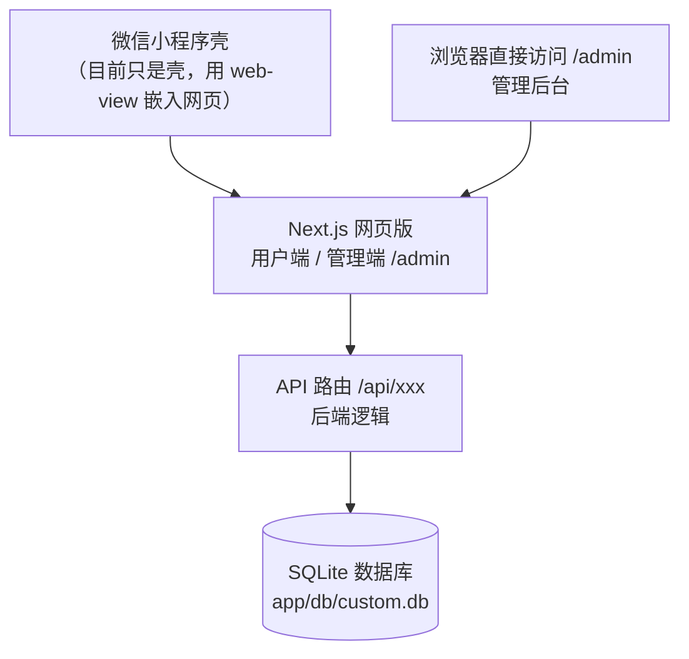
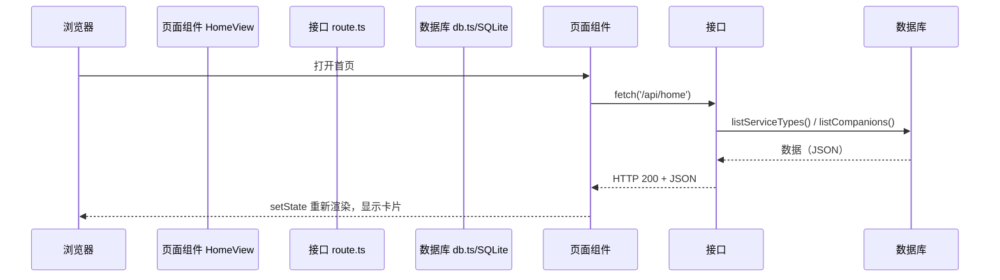

# 三角洲游戏服务平台 · 保姆级开发教程

> 写给零基础、非计算机专业、现在要负责开发/讲解/维护这套系统的人。
> 建议按顺序读，遇到不懂的术语先跳到文末《术语表》查一下，再回来继续。

---

## 第一章：先搞懂"一个网站是怎么工作的"

在你打开浏览器输入网址的时候，其实发生了三件事：

1. **浏览器**（你）向**服务器**（别人家的电脑）发出一条请求："把三角洲游戏服务平台的页面给我。"
2. **服务器**收到请求，去**数据库**里查数据（"有哪些陪玩？"），然后把结果拼成网页发回给浏览器。
3. **浏览器**把收到的网页画出来给你看。

用我们系统打个比方：

```text
浏览器（顾客）  ──请求──▶  服务器（餐厅前台）  ──查数据──▶  数据库（仓库）
浏览器（顾客）  ◀──网页──   服务器（餐厅前台）  ◀──数据──   数据库（仓库）
```

所以一套网站程序，永远要分成三块来理解：

| 角色 | 干什么 | 我们系统里对应谁 |
| --- | --- | --- |
| 前端 | 负责"画面"，用户看到和点击的一切 | `app/src/components/`、`app/src/app/page.tsx` |
| 后端 | 负责"逻辑"，处理请求、读写数据 | `app/src/app/api/`、`app/src/lib/db.ts` |
| 数据库 | 负责"存数据" | `app/db/custom.db`（SQLite 文件） |

记住这个"前端 → 后端 → 数据库"的三角关系，后面所有代码都能对号入座。

## 第二章：我们的系统整体长什么样



几个关键点：

1. **用户端**：顾客在微信小程序里看到的是网页版（web-view 嵌入），地址是 `http://localhost:3000/`。
2. **管理端**：管理者在浏览器直接打开 `http://localhost:3000/admin`，是同一套程序里的另一个区域。
3. **一个程序，两个"入口"**：Next.js 里 `/` 是用户端，`/admin` 是管理端，它们共用同一个数据库和后端。
4. **数据都存本地**：SQLite 就是 `app/db/custom.db` 这一个文件，不需要另外装数据库软件，这也是"便携版"能双击就跑的原因。

## 第三章：技术栈逐个解释（不背，理解即可）

### Node.js

- 让 JavaScript 能脱离浏览器、在电脑上直接运行的"运行时"。
- 我们的服务器就是用 Node.js 跑起来的（`node\node.exe`）。
- 为什么项目里自带一个 `node` 文件夹？因为我们要用 SQLite 的实验功能，对 Node 版本有要求，所以打包了一份指定版本的 Node，保证任何电脑双击 `start.bat` 都能跑，不依赖对方电脑装没装 Node。

### Next.js

- 一个"前端 + 后端一体的网站框架"，基于 React。
- 它规定好了一套目录规则：`app/` 里的文件就是页面和接口。
- 我们用的是 **App Router**（新版目录方式）：`src/app/page.tsx` 是首页，`src/app/admin/` 是管理端页面，`src/app/api/` 是接口。

### React

- 一个"用组件拼页面"的 JavaScript 库。
- **组件（Component）** = 一块可以重复使用的界面积木，比如一张陪玩卡片 `CompanionCard`。
- **状态（State）** = 组件自己的记忆，比如"当前选中的排序方式"。
- **Props** = 父组件传给子组件的参数，比如"把某个陪玩数据传进卡片组件"。
- 数据一变，页面自动重新画（不需要手动操作 DOM），这是 React 最核心的思想。

### TypeScript

- 在 JavaScript 上加了一层"类型"（type），比如"这个变量必须是数字、那个对象必须有 name 字段"。
- 好处：写错时编辑器/编译会立刻提示，减少低级 bug。
- 类型定义集中在 `src/lib/types.ts`，是理解数据的"说明书"。

### Tailwind CSS

- 不用写单独的 `.css` 文件，直接在标签的 `className` 里写工具类，比如 `bg-surface`（背景色）、`rounded-card`（圆角）。
- 颜色、圆角这些"设计变量"定义在 `tailwind.config.ts` 和 `src/styles/globals.css`。

### SQLite

- 一个文件型数据库，整个数据库就是 `custom.db` 一个文件。
- 用 SQL 语句操作，比如 `SELECT * FROM Companion`。
- 我们通过 Node 内置的 `node:sqlite` 模块来读写它（所以启动命令要带 `--experimental-sqlite`）。

### npm

- Node 的"软件管家"，用来安装第三方代码包。
- `package.json` 是购物清单；`node_modules` 是买回来的东西。
- 常用命令：`npm install`（按清单装依赖）、`npm run dev`（跑开发模式）、`npm run build`（打包）。

## 第四章：目录结构逐层讲解

```text
delta_app/
├── app/                          # ★ 全部源码和运行文件
│   ├── src/                      # 源代码（改代码基本都在这）
│   │   ├── app/
│   │   │   ├── layout.tsx        # 整个网站的"外壳"（背景、字体）
│   │   │   ├── page.tsx          # 用户端首页入口 → 渲染 UserApp
│   │   │   ├── admin/            # 管理端页面（/admin/...）
│   │   │   │   ├── layout.tsx    # 管理端外壳（侧边栏）
│   │   │   │   ├── page.tsx      # 仪表盘
│   │   │   │   ├── orders/       # 订单管理
│   │   │   │   ├── companions/   # 陪玩管理
│   │   │   │   ├── service-types/# 服务类型
│   │   │   │   ├── messages/     # 消息管理
│   │   │   │   ├── stats/        # 数据统计
│   │   │   │   └── settings/     # 设置
│   │   │   └── api/              # 后端接口（/api/...）
│   │   │       ├── home/route.ts        # 首页聚合数据
│   │   │       ├── service-types/route.ts
│   │   │       ├── companions/route.ts  # 陪玩列表/新增
│   │   │       ├── orders/route.ts      # 订单列表/下单
│   │   │       ├── messages/route.ts    # 消息列表
│   │   │       └── admin/...            # 管理端专用接口
│   │   ├── components/
│   │   │   ├── ui.tsx            # 通用积木：按钮/卡片/输入框/图标…
│   │   │   ├── user/             # 用户端页面组件（HomeView 等）
│   │   │   └── admin/            # 管理端组件（AdminShell 侧边栏）
│   │   ├── lib/
│   │   │   ├── db.ts             # ★ 数据库操作全集（所有 SQL 在这）
│   │   │   ├── types.ts          # ★ 数据"说明书"（类型定义）
│   │   │   └── client.ts         # 前端发请求的工具函数
│   │   └── styles/globals.css    # 全局样式 + 颜色变量
│   ├── db/custom.db              # ★ 数据库文件（数据都在这）
│   ├── scripts/
│   │   ├── seed.cjs              # 初始化/重置演示数据
│   │   └── postbuild.cjs         # 打包后复制静态文件
│   ├── server.js                 # 生产模式启动器（start.bat 用它）
│   ├── next.config.ts            # Next.js 配置
│   ├── tailwind.config.ts        # 样式配置（颜色/圆角变量）
│   ├── package.json              # 依赖清单 + 命令
│   └── tsconfig.json             # TypeScript 配置
├── node/                         # 内置 Node.js 运行时（别动）
├── start.bat                     # 双击启动（GBK+CRLF 编码，别用记事本改乱）
├── project.config.json           # 微信开发者工具配置
└── 参考图片/                      # 参考图片（不动）
```

**记法**：`components/` 管画面，`app/api/` 管接口，`lib/db.ts` 管数据库，`types.ts` 管数据形状。改什么需求，先想清楚它是"画面、接口、还是数据"，再去找对应文件。

## 第五章：一次请求的完整旅程（最重要的一章）

我们用一个真实例子：**用户打开首页，看到"热门推荐"里的陪玩列表**。这一路经过了哪些代码？

### 第 1 步：页面组件加载

浏览器打开 `/`，Next.js 渲染 [page.tsx](app/src/app/page.tsx)：

```tsx
import UserApp from '@/components/user/UserApp'

export default function Page() {
  return <UserApp />
}
```

`UserApp` 是"用户端总开关"，它根据 `view`（当前视图）显示对应页面。默认显示 `HomeView`（首页）。

### 第 2 步：首页组件去"要数据"

打开 [HomeView.tsx](app/src/components/user/HomeView.tsx)，里面有这样一段：

```tsx
useEffect(() => {
  api<HomeData>('/api/home')
    .then(setData)
    .catch(() => setData(null))
    .finally(() => setLoaded(true))
}, [])
```

翻译成人话：**组件一出现，就向 `/api/home` 发请求**。`useEffect` 是 React 的"时机钩子"，`[]` 表示只在第一次加载时执行一次。`api()` 是封装好的 `fetch`（发请求的函数），`setData` 把拿到的数据存进 state，页面就会重新画出来。

### 第 3 步：请求到达后端接口

`/api/home` 这个地址，对应文件 [app/src/app/api/home/route.ts](app/src/app/api/home/route.ts)：

```ts
export async function GET() {
  const serviceTypes = listServiceTypes(false).filter((s) => !s.reserved)
  const hot = listCompanions({ sort: 'sales' }).slice(0, 6)
  ...
  return NextResponse.json({ serviceTypes, hot, banners })
}
```

Next.js 的规矩：**`route.ts` 里导出 `GET` 函数 = 响应 GET 请求**，`POST` 函数 = 响应 POST 请求。这里就是后端入口。

### 第 4 步：后端去查数据库

`listCompanions` 定义在 [lib/db.ts](app/src/lib/db.ts)，它会执行 SQL：

```ts
db.prepare(`SELECT * FROM Companion WHERE deleted = 0 ... ORDER BY sales DESC LIMIT 200`).all(...)
```

`getDb()` 负责打开 `app/db/custom.db` 这个文件。查完把数据变成 JSON 返回。

### 第 5 步：数据回到页面

浏览器收到 JSON，`setData` 更新状态，HomeView 重新渲染，热门推荐卡片就显示出来了。

### 一张图总结



**以后看任何功能都按这 5 步走**：页面 → 接口 → 数据库 → 返回 → 渲染。这个思路就是排查 bug 的地图。

## 第六章：数据库（5 张表）

打开 `app/db/custom.db` 需要工具（如 DB Browser for SQLite），但我们先看结构，结构在 `db.ts` 和 `seed.cjs` 里都能看到。

| 表名 | 干什么 | 关键字段 |
| --- | --- | --- |
| ServiceType | 服务类型 | name（陪玩/护航/趣味单）、enabled（是否启用）、reserved（是否预留） |
| Companion | 陪玩/服务商品 | name、gender（女陪/男陪）、tags（标签）、price、unit（小时/局）、rank（段位）、status（在售/下架）、sales（销量） |
| Order | 订单 | orderNo（订单号）、companionName（快照）、serviceName、unitCount、amount、status、customerId |
| Message | 消息 | type（official 官方 / customer_service 客服）、title、content |
| AppSetting | 键值设置 | key、value（店铺名、客服微信、公告） |

三个容易混的概念：

1. **为什么 Order 里存 companionName 而不是只存 id？** 这叫"快照"。订单成交那一刻，把名字和价格原样存一份，以后陪玩改名/改价也不影响历史订单。
2. **status 字段**：订单状态是字符串：`pending`（待接单）→ `in_progress`（进行中）→ `completed`（已完成）/ `cancelled`（已取消）。
3. **customerId**：目前没做登录，前端在浏览器本地存了一个随机 ID（`localStorage` 里的 `delta_cid`），"我的订单"就靠它认出"这个订单是我的"。

### 怎么重置数据？

```bash
node --experimental-sqlite scripts/seed.cjs
```

注意：这条命令会**清空所有数据**（订单、陪玩全被删掉重来），只在测试阶段用。正式使用后别随便跑。

## 第七章：用户端代码讲解

### 7.1 总开关：UserApp.tsx

[UserApp.tsx](app/src/components/user/UserApp.tsx) 是用户端的"路由器"。它用两个变量控制界面：

- `tab`：底部 4 个 Tab（首页/分类/消息/我的）
- `view`：当前更细的"视图"（首页、陪玩详情、确认订单、我的订单、订单详情、消息详情…）

```tsx
const [view, setView] = useState<ViewState>({ name: 'home' })
```

`view.name` 是 `'home'` 就渲染 HomeView，是 `'detail'` 就渲染陪玩详情……这就是"视图状态机"。**没有用真正的网页跳转**，因为微信 web-view 里频繁跳转体验差，我们选择"换内容不换页面"。

### 7.2 几个常用组件

- [HomeView.tsx](app/src/components/user/HomeView.tsx)：首页。搜索框、Banner、服务类型入口、热门推荐、排序。
- [CategoryView.tsx](app/src/components/user/CategoryView.tsx)：分类页。左侧服务类型，右侧陪玩卡片。
- [CompanionDetail.tsx](app/src/components/user/CompanionDetail.tsx)：陪玩详情，选时长/局数。
- [CheckoutView.tsx](app/src/components/user/CheckoutView.tsx)：确认订单，填区服/段位/备注，提交。
- [OrdersView.tsx](app/src/components/user/OrdersView.tsx) / [OrderDetailView.tsx](app/src/components/user/OrderDetailView.tsx)：我的订单。
- [MessagesView.tsx](app/src/components/user/MessagesView.tsx)：官方公告 + 客服消息。
- [ProfileView.tsx](app/src/components/user/ProfileView.tsx)：我的（全部是占位）。
- [CompanionCard.tsx](app/src/components/user/CompanionCard.tsx)：被复用的陪玩卡片。
- [TabBar.tsx](app/src/components/user/TabBar.tsx)：底部导航条。

### 7.3 一个卡片组件长什么样

```tsx
<Card className="...">
  <button type="button" onClick={onClick} className="...">
    <Avatar name={companion.name} size={56} />
    <span>{companion.name}</span>
    <span>{companion.price}元/{companion.unit}</span>
  </button>
</Card>
```

- `{companion.name}`：把数据插进界面，这叫 JSX 插值。
- `onClick={onClick}`：用户点击时执行传入的函数。
- 这个组件自己不存数据，数据是父组件通过 props 传进来的——这样卡片可以到处复用。

## 第八章：管理端代码讲解

管理端入口是 `/admin`，结构：

- [admin/layout.tsx](app/src/app/admin/layout.tsx) + [AdminShell.tsx](app/src/components/admin/AdminShell.tsx)：带侧边栏的外壳，所有管理页面都套在里面。
- [admin/page.tsx](app/src/app/admin/page.tsx)：仪表盘，请求 `/api/admin/stats` 显示四个统计卡片 + 待接单列表。
- [admin/orders/page.tsx](app/src/app/admin/orders/page.tsx)：订单管理。按状态筛选，点"接单"就调 `PATCH /api/orders/订单id` 把状态改成 `in_progress`。
- [admin/companions/page.tsx](app/src/app/admin/companions/page.tsx)：陪玩管理。弹窗表单新增/编辑，上下架、删除。
- [admin/service-types/page.tsx](app/src/app/admin/service-types/page.tsx)：服务类型管理。
- [admin/messages/page.tsx](app/src/app/admin/messages/page.tsx)：发布公告。
- [admin/stats/page.tsx](app/src/app/admin/stats/page.tsx)：统计展示。
- [admin/settings/page.tsx](app/src/app/admin/settings/page.tsx)：店铺设置。

管理端和用户端**共用同一套接口和数据库**，只是页面不同。比如用户端下单选 `POST /api/orders`，管理端改状态也是 `PATCH /api/orders/[id]`——接口是同一份代码，这就是"前后端共享一个后端"的好处。

## 第九章：前端基础速成（看懂页面代码够用）

### 9.1 JSX：在 JS 里写 HTML

```tsx
<div className="text-red">你好</div>
```

注意是 `className` 不是 `class`。`{变量}` 可以把 JS 值插进去。

### 9.2 组件 = 函数

```tsx
function Hello({ name }: { name: string }) {
  return <div>你好，{name}</div>
}
```

`{ name }` 是从外部传进来的参数（props），返回值就是要画的界面。

### 9.3 state：组件的记忆

```tsx
const [count, setCount] = useState(0)
```

`count` 是当前值，`setCount(新值)` 改值并自动重画页面。

### 9.4 useEffect：时机钩子

```tsx
useEffect(() => {
  // 组件第一次出现时执行这里
}, [])
```

我们主要用它来"加载时请求数据"。`[]`（依赖数组）表示只在首次执行；如果放变量进去，变量变化时也会重新执行。

### 9.5 fetch / api()：发请求

```ts
const data = await fetch('/api/xxx').then((r) => r.json())
```

我们封装成了 [client.ts](app/src/lib/client.ts) 的 `api()`，会自动处理错误。页面里基本都是：

```tsx
useEffect(() => {
  api<Companion[]>('/api/companions').then(setList)
}, [])
```

### 9.6 条件渲染与列表

```tsx
{list.length === 0 ? <Empty /> : list.map((c) => <Card key={c.id} />)}
```

- `条件 ? A : B`：成立显示 A，否则显示 B。
- `list.map(...)`：把数组变成一列组件，`key` 让 React 知道谁是谁。

## 第十章：常见修改手册（照着改就行）

### 10.1 改主题色（比如换成浅蓝更亮）

打开 [globals.css](app/src/styles/globals.css)，顶部就是颜色变量：

```css
:root {
  --primary: #4fc3f7;   /* 主色（浅蓝） */
  --bg: #0b0f17;        /* 页面背景 */
  ...
}
```

改这里，全站颜色跟着变。**变量名别改**，只改色值。

### 10.2 改首页 Banner 文案

两处：

1. 接口里：[api/home/route.ts](app/src/app/api/home/route.ts) 的 `banners` 数组是真实数据源。
2. 组件里的兜底文案：[HomeView.tsx](app/src/components/user/HomeView.tsx) 的 `banner` 变量（接口失败时显示）。

### 10.3 加一个陪玩（最快方式）

方式 A（界面操作）：打开管理后台 → 陪玩管理 → 新增陪玩。

方式 B（改种子数据）：编辑 [seed.cjs](app/scripts/seed.cjs) 里的 `companions` 数组，然后重新跑 seed（会清空数据）。

### 10.4 改陪玩显示字段

改数据模型（[db.ts](app/src/lib/db.ts) 的建表 SQL + [types.ts](app/src/lib/types.ts)）→ 改卡片组件 [CompanionCard.tsx](app/src/components/user/CompanionCard.tsx) → 改管理端表单 [admin/companions/page.tsx](app/src/app/admin/companions/page.tsx)。"数据层 → 展示层 → 编辑层"三处都要动。

### 10.5 改订单状态文案

[ui.tsx](app/src/components/ui.tsx) 里的 `STATUS_MAP`：`pending → 待接单`、`in_progress → 进行中` 等。改这里，全站标签同步变。

### 10.6 管理端加一个新菜单页

1. 新建 `app/src/app/admin/新页面/page.tsx`（复制 orders 页改）。
2. 在 [AdminShell.tsx](app/src/components/admin/AdminShell.tsx) 的 `NAV` 数组里加一项。

## 第十一章：运行与构建

| 场景 | 命令/操作 | 说明 |
| --- | --- | --- |
| 日常开发 | 在 `app` 目录跑 `npm run dev` | 改代码自动刷新，报错信息最详细 |
| 给别人用 | 双击根目录 `start.bat` | 跑的是打包好的生产版，改代码后需要先构建 |
| 打包 | 在 `app` 目录跑 `npm run build` | 生成 `.next` 生产产物 |
| 重置数据 | `node --experimental-sqlite scripts/seed.cjs` | 清空数据恢复演示数据 |

必须用内置 Node 的原因：系统 Node 是 v20，而 `node:sqlite` 需要 v22+，所以命令里都带 `--experimental-sqlite`，`start.bat` 直接调用 `node\node.exe`。

**开发流程口诀**：改代码 → `npm run dev` 看效果 → 确认没问题 → `npm run build` → 交给使用的人双击 `start.bat`。

## 第十二章：排查 Bug 三步法

### 第 1 步：看浏览器（用户端问题）

按 F12 打开开发者工具：

- **Console（控制台）**：红色报错就是 JS 错误，把红字读一遍。
- **Network（网络）**：刷新页面，看 `/api/...` 请求。`200` 正常、`4xx` 参数/权限问题、`500` 服务器内部错误。点开请求能看返回的 `error` 信息，基本就是原因。
- **Application → Local Storage**：能看到 `delta_cid`（本地身份标识）。

### 第 2 步：看服务器日志（后端问题）

- `npm run dev` 的终端窗口会直接打印报错堆栈。
- 双击 `start.bat` 的黑色窗口也会打印。
- 最常见的错误格式：`Error: ... at ...`，从第一行 "Error:" 开始看。

### 第 3 步：用"请求旅程"地图定位

拿到报错后，问自己：是**页面代码**的问题（组件报错/数据没显示），**接口**的问题（Network 里 500），还是**数据库**的问题（SQL 报错，如 no such column）？按第五章的 5 步流程，报错发生在哪一步，就去哪一层找。

### 常见报错对照表

| 现象 | 常见原因 | 解决办法 |
| --- | --- | --- |
| `EADDRINUSE` / 端口被占用 | 3000 端口已有服务在跑 | 关掉旧窗口，或改 `-p 3001` |
| `no such column: xxx` | 改了表结构但数据库还是旧的 | 重新跑 seed 或重建数据库 |
| `Cannot find module` | 依赖没装全 | 在 app 目录跑 `npm install` |
| 页面白屏/报错红字 | JS 运行时错误 | F12 看 Console 第一条红字 |
| 接口 500 | 后端代码抛异常 | 看服务端日志 + 接口返回的 error 字段 |
| 中文乱码 | 文件编码不对 | 源码用 UTF-8，`start.bat` 必须是 GBK+CRLF |
| 改了代码没效果 | 跑的是旧构建 | 重新 `npm run build` |

## 第十三章：常见的"坑"（提前知道少走弯路）

1. **`start.bat` 编码**：必须是 GBK 编码 + CRLF 换行，用记事本另存为时选 ANSI。改坏会像之前那样满屏乱码报错。
2. **数据库是单文件**：备份 = 复制 `custom.db`。正式使用前建议经常备份。
3. **seed 会清空数据**：千万别在生产环境随手跑。
4. **微信 web-view 限制**：上线必须 HTTPS 域名并在微信公众平台配置业务域名；支付需要微信支付商户号；登录需要微信授权。这些是 P4 的事，但提前知道。
5. **Node 版本**：必须用项目自带 `node\node.exe`（v22+），系统 Node 20 跑不了。
6. **`rank` 是 SQLite 关键字**：表里那个字段叫 `"rank"`（带引号），改名或删字段时注意。

## 第十四章：怎么给别人讲 + 学习路线

### 一分钟讲清楚这个系统（给老板/同事）

> "我们做的是一个游戏陪玩点单平台，跑在微信里。顾客进来选陪玩/护航/趣味单、选时长、填区服和段位，提交订单；店里的管理后台能看到待接单，接单后就进入'进行中'，服务完点完成。技术上是网页版（Next.js），数据存在本地 SQLite 文件里，双击 start.bat 就能跑，不依赖外部服务。"

### 讲得更深（对方问细节时）

- "为什么是网页版？" → 微信小程序用 web-view 嵌入网页，改网页不用发小程序审核。
- "数据存在哪？" → `app/db/custom.db`，SQLite 单文件。
- "前后端怎么分的？" → `components/` 是界面，`api/` 是接口，`db.ts` 是数据库操作。

### 建议学习顺序（按需学，不用全学完）

1. **HTML/CSS 基础**（1~2 周）：能看懂标签和样式。推荐 MDN 或 W3School 中文。
2. **JavaScript 基础**：变量、函数、数组、对象、`fetch`、Promise。
3. **React 基础**：组件、props、state、useEffect。看官方"Tic-Tac-Toe"教程。
4. **跟着本项目实战**：按本教程第十章改点小东西（改颜色、加陪玩）。
5. **SQL 基础**：`SELECT / INSERT / UPDATE / DELETE`，能看懂 db.ts 即可。
6. **Next.js 概念**：页面、路由、API Route。

工具推荐：VSCode（写代码）、DB Browser for SQLite（看数据库）、微信开发者工具（预览小程序壳）。

## 术语表（Glossary）

| 术语 | 人话解释 |
| --- | --- |
| 前端 | 用户看到的界面和交互 |
| 后端 | 处理请求、读写数据的服务程序 |
| 数据库 | 存数据的仓库 |
| API / 接口 | 前后端约好的"数据交换窗口"，如 `/api/companions` |
| 组件（Component） | 一块可复用的界面积木 |
| Props | 传给组件的参数 |
| State（状态） | 组件的记忆，变了就重画 |
| useEffect | 在特定时机执行的钩子（我们用于加载数据） |
| fetch | 浏览器发网络请求的 API |
| JSON | 前后端传输数据的文本格式（`{ "name": "星河" }`） |
| 路由 | 网址到代码文件的对应关系 |
| SQL | 操作数据库的语言 |
| SQLite | 单文件数据库 |
| npm | Node 的包管理器（装依赖、跑命令） |
| 构建（build） | 把源码打包成可运行的产物（`.next`） |
| 部署 | 把程序放到服务器上让别人访问 |
| web-view | 微信小程序里嵌网页的组件 |
| localStorage | 浏览器本地存储，关掉浏览器也在 |
| 快照 | 下单时把名称/价格原样存一份，防以后变更影响历史 |
| 状态机 | 用变量控制界面/数据在不同状态间切换的机制 |

---

> 遇到看不懂的代码，先复制进编辑器，用"变量名 → 数据流向"的方式读：这个变量从哪来？被用到哪？改哪一行会有什么影响？把本教程和源码对照着读，多改几处小东西，很快就熟了。

---

## 第十五章：用 Git 管理版本（日常维护核心）

> 你的电脑已经安装 Git（D:\Git），项目也已经提交了第一个版本。这一章教你怎么用它做"日常保存"和"出错回滚"。

### 15.1 先搞清楚 Git 的三个区

```text
工作区（你正在改的文件）
   │  git add -A（把改动装进袋子）
   ▼
暂存区（袋子）
   │  git commit -m "说明"（封袋存档）
   ▼
版本库（历史档案柜，每个版本都能找回）
```

- **git add** 只做"准备"，**git commit** 才真正存一个新版本。
- 每次 commit 都会得到一个版本号（如 `86ebf98`），随时可以跳回去。

### 15.2 日常三连（每次改完代码都做）

在项目文件夹里打开 Git Bash（右键项目文件夹 → Git Bash Here），依次输入：

```bash
git status              # 第 1 步：看改动了哪些文件
git add -A              # 第 2 步：把所有改动装进暂存区
git commit -m "这里写你改了什么"   # 第 3 步：保存一个新版本
```

查看历史：

```bash
git log --oneline       # 一行一个版本，最新的在最上面
```

提交信息写清楚很重要，比如 `修复订单金额显示错误`、`新增趣味单类型`，以后翻历史一眼就懂。

### 15.3 出错回滚

**只撤销一个文件的修改**（还没提交时）：

```bash
git restore 文件名
```

**回到上一个版本**（已提交，但后面改坏了）：

```bash
git log --oneline       # 先看版本号
git reset --hard HEAD~1 # 回到上一个版本
```

⚠️ `reset --hard` 会**永久丢弃**这个版本之后的所有改动，执行前一定先 `git status` 和 `git log` 看清楚。拿不准时，可以先把当前文件复制一份到别处再操作。

**查看某次提交改了什么**：

```bash
git show 版本号
```

### 15.4 动手练习（强烈建议做一遍）

1. 用 VSCode 打开 `app/src/styles/globals.css`，把 `--primary: #4fc3f7;` 改成 `--primary: #38bdf8;` 保存。
2. 在 Git Bash 里依次输入 `git status` → `git add -A` → `git commit -m "调整主色调"`。
3. 输入 `git log --oneline`，你会看到两个版本。
4. 再把颜色改回去，然后输入 `git restore app/src/styles/globals.css`——文件立刻恢复成"调整主色调"版本的样子。

做完这四步，你就真正理解 Git 了。

### 15.5 小贴士

- **勤提交**：每完成一个小改动就提交一次，别憋一大坨。改动越小，回滚越精准。
- **数据要单独备份**：`app/db/custom.db` 被排除在 Git 之外（数据不进版本库），重要数据靠复制这个文件备份。
- **`.gitignore` 帮你挡掉大文件**：`node_modules`、`.next`、`node/` 都不会进仓库，所以提交非常快。
- **别怕**：最坏情况是 `reset --hard` 丢改动，但只要记得常提交，就能找回任何历史版本。
